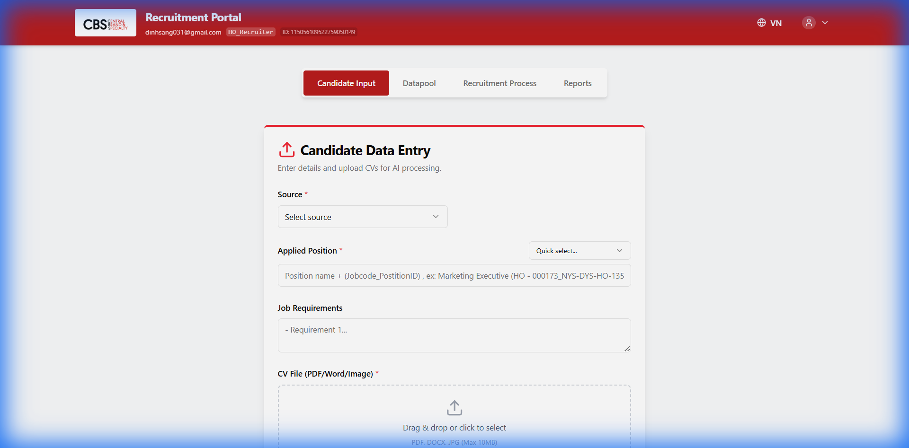
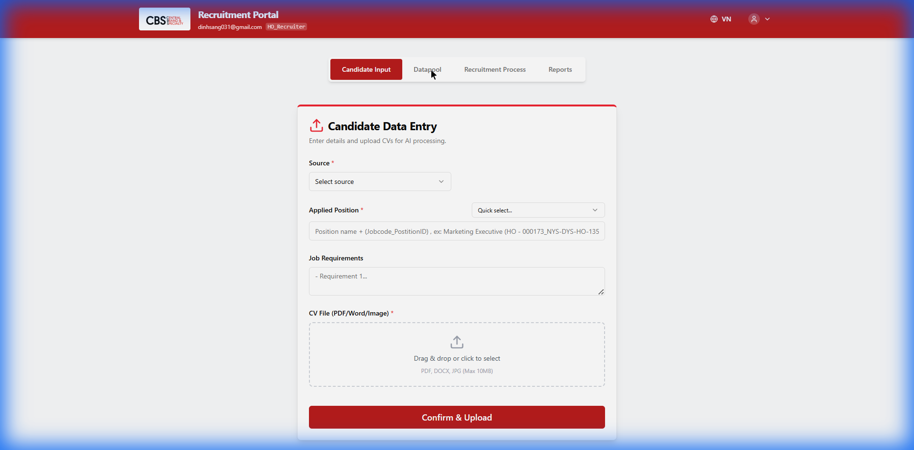
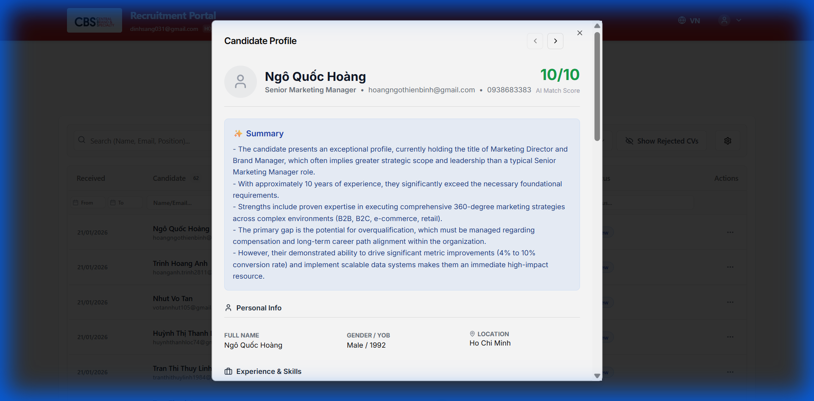
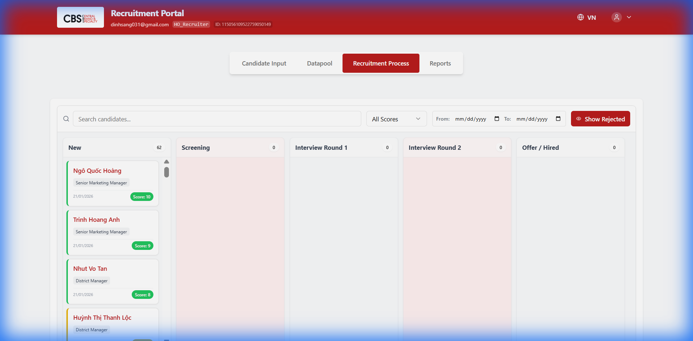
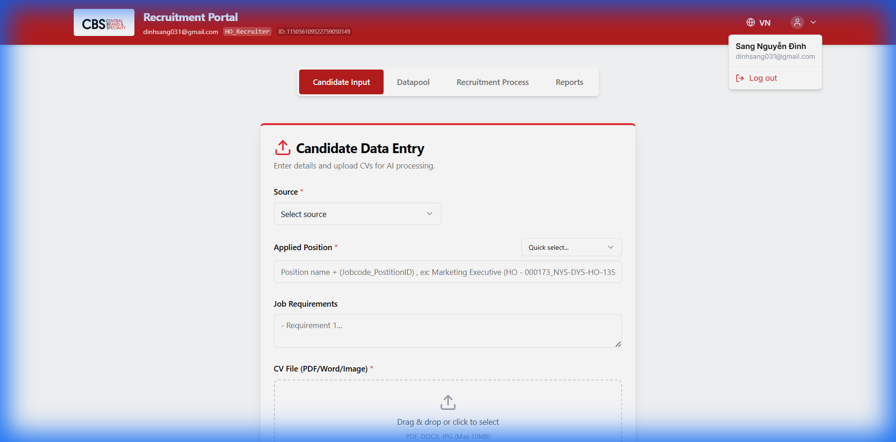

# Hướng Dẫn Sử Dụng CBS Recruitment Web App

Tài liệu này hướng dẫn chi tiết cách sử dụng phần mềm Tuyển dụng CBS cho Recruiter.

## 1. Thực Trạng & Giải Pháp AI

### Tại sao chúng ta cần hệ thống này?

**Thực trạng tuyển dụng truyền thống:**

- **Tốn thời gian**: Recruiter phải mở từng file CV (PDF/Word) để đọc và nhập liệu thủ công vào Excel.
- **Dữ liệu phân tán**: CV nằm rải rác trên Email, Link Google Drive và máy cá nhân, khó quản lý tập trung.
- **Đánh giá cảm tính**: Việc sàng lọc thủ công dễ bị bỏ sót ứng viên tiềm năng hoặc đánh giá không đồng nhất.

**Giải Pháp AI của CBS Recruitment App:**
Hệ thống tích hợp trí tuệ nhân tạo (AI) để giải quyết các vấn đề trên:

1.  **Tự động hóa**: AI tự động đọc hiểu file CV, trích xuất thông tin quan trọng (Tên, Email, Kỹ năng, Học vấn) và điền vào bảng dữ liệu.
2.  **Chấm điểm thông minh (Matching Score)**: Hệ thống tự động so sánh năng lực ứng viên với Mô tả công việc (JD) để đưa ra điểm số phù hợp (Xanh/Vàng/Đỏ), giúp Recruiter ưu tiên xử lý hồ sơ tốt nhất.
3.  **Tóm tắt hồ sơ**: Thay vì đọc 5 trang CV, Recruiter chỉ cần đọc 3 dòng tóm tắt do AI tổng hợp để nắm bắt nhanh điểm mạnh/yếu của ứng viên.

---

## 2. Tổng Quan Luồng Ứng Viên (Candidate Flow)

Trước khi đi vào chi tiết, bạn cần hiểu cách một ứng viên xuất hiện trong hệ thống. Có 2 luồng chính:

1.  **Luồng Tự Động (Auto from Email)**:
    - Hệ thống tự động quét Email tuyển dụng.
    - Khi có ứng viên gửi CV qua Email, hệ thống tự động bóc tách thông tin và đưa thẳng vào **Kho Dữ Liệu (Datapool)**.
    - _Recruiter không cần nhập tay_.
2.  **Luồng Thủ Công (Manual Input)**:
    - Dùng cho các trường hợp: CV nhận tay, CV tải từ LinkedIn/TopCV về máy, hoặc CV giấy.
    - Recruiter sử dụng **Tab Input** trên Web App để đẩy vào hệ thống.

### Sơ Đồ Luồng Xử Lý

```text
[NGUỒN ỨNG VIÊN]
      │
      ├──> (1) Tự Động: Email tuyển dụng  ──────┐
      │                                         │
      └──> (2) Thủ Công: Upload tại Tab Input ──┼──> [KHO DỮ LIỆU - DATAPOOL]
                                                │          (Tab Datapool)
                                                │          │
                                                │          ├──> Xem chi tiết / Lọc CV
                                                │          ├──> Đánh giá (AI Score)
                                                │          └──> Loại (Reject)
                                                │
                                                └──> [QUY TRÌNH PHỎNG VẤN]
                                                           (Tab Process/Kanban)
                                                           │
                                                           ├──> New (Mới)
                                                           ├──> Screening (Sàng lọc)
                                                           ├──> Interview (Phỏng vấn)
                                                           ├──> Offer (Đề xuất)
                                                           └──> Hired / Rejected
```

---

## 3. Đăng Nhập (Login)

1.  Truy cập vào đường dẫn Web App (URL do Admin cung cấp).
2.  Tại màn hình Chào mừng, nhấp vào nút **"Login to Access"**.
3.  Chọn tài khoản **Google (Gmail)** công ty hoặc cá nhân đã được cấp quyền.
4.  Sau khi đăng nhập thành công, bạn sẽ được chuyển đến giao diện chính của phần mềm.

---

## 4. Tab 1: Nhập Liệu Thủ Công (Input)

Chức năng này dùng cho **Luồng Thủ Công** (khi ứng viên không đến từ Email tự động).



### Các bước thực hiện:

- **Tải lên CV (Upload CV)**:
  - Kéo và thả file PDF CV vào vùng upload (hoặc click để chọn file từ máy tính).
  - _Lưu ý_: Hỗ trợ file đuôi `.pdf`, `.docx`, và hình ảnh.
- **Chọn Nguồn (Source)**:
  - Chọn nguồn ứng viên từ dropdown (LinkedIn, TopCV, Email, Referral, v.v.).
- **Điền Vị trí ứng tuyển (Applied Position)**:
  - Nhập hoặc chọn vị trí từ danh sách gợi ý.
- **Yêu cầu công việc (Job Requirements)**:
  - Điền mô tả ngắn gọn về yêu cầu công việc (tùy chọn).
- **Gửi (Submit)**:
  - Nhấn nút **"Submit Candidate"**.
  - Khi thành công, hệ thống thông báo "Upload Successful" và dữ liệu sẽ được lưu vào Datapool.

---

## 5. Tab 2: Kho Dữ Liệu (Datapool)

Nơi quản lý toàn bộ hồ sơ ứng viên (đến từ cả Email tự động và Nhập tay).



### Các tính năng chính:

- **Xem danh sách**: Dữ liệu hiển thị dưới dạng bảng chi tiết với các cột:
  - **Received**: Ngày nhận hồ sơ
  - **Candidate**: Tên và email ứng viên
  - **Position**: Vị trí ứng tuyển
  - **AI Score**: Điểm đánh giá AI (có màu sắc: xanh lá = cao, vàng = trung bình, đỏ = thấp)
  - **Source**: Nguồn ứng viên
  - **Status**: Trạng thái hiện tại
- **Bộ lọc (Filters)**:
  - **Tìm kiếm nhanh**: Thanh tìm kiếm phía trên để tìm theo tên, email, hoặc vị trí
  - **AI Score**: Dropdown lọc theo điểm AI (All, High >=8, Medium 5-7, Low <5)
  - **Thời gian (Received)**: Chọn khoảng ngày "From" (Từ) và "To" (Đến) ngay dưới header cột
  - **Lọc theo cột**: Mỗi cột có ô tìm kiếm riêng để lọc nhanh
- **Số liệu thống kê**:
  - Các badge hiển thị tổng số ứng viên, số vị trí, và số nguồn khác nhau

### Xem chi tiết ứng viên:



- Nhấn vào **tên ứng viên** để mở cửa sổ chi tiết
- Cửa sổ hiển thị:
  - **AI Match Score**: Điểm đánh giá phù hợp (có màu sắc)
  - **Summary**: Tóm tắt hồ sơ do AI tạo
  - **Thông tin cá nhân**: Email, SĐT, Địa chỉ
  - **Học vấn**: Bằng cấp và trường học
  - **Kinh nghiệm**: Lịch sử công việc
  - **Kỹ năng**: Danh sách kỹ năng chính
  - **Chứng chỉ**: Các chứng chỉ liên quan
  - **Link CV**: Nút mở file CV gốc
- **Thao tác nhanh** từ modal:
  - **Process**: Chuyển sang quy trình phỏng vấn
  - **Decline**: Từ chối ứng viên
  - **Mũi tên trái/phải**: Xem ứng viên trước/sau

### Thao tác xử lý:

- **Proceed to Screening**: Chuyển ứng viên sang tab Process để bắt đầu phỏng vấn
- **Reject (Loại)**: Đánh dấu hồ sơ không đạt, có thể chọn lý do và đánh dấu "Hồ sơ tiềm năng"
- **Withdraw**: Ứng viên tự rút lui (trả lại trạng thái New)

---

## 6. Tab 3: Quy Trình (Process / Kanban)

Nơi theo dõi tiến độ phỏng vấn của các ứng viên đang được xử lý.



### Các tính năng:

- **Giao diện Kanban**: Các cột tương ứng với các bước tuyển dụng:
  - **New**: Ứng viên mới.
  - **Screening**: Đang sàng lọc.
  - **Interview Round 1**: Phỏng vấn vòng 1.
  - **Interview Round 2**: Phỏng vấn vòng 2.
  - **Offer / Hired**: Đã gửi offer hoặc đã tuyển dụng chính thức (Nhóm chung).
- **Bộ lọc Job Code**:
  - Chọn mã Job cụ thể để xem ứng viên của Job đó.
  - Có thể thực hiện **Stop Recruitment** (Ngưng tuyển) cho Job đang chọn.
  - **Stock View**: Xem danh sách ứng viên của các Job đã ngưng tuyển.
- **Chuyển trạng thái**:
  - **Kéo và Thả**: Nhấn giữ thẻ ứng viên và kéo sang cột mong muốn.
  - Hệ thống tự động cập nhật trạng thái vào Google Sheet.
- **Loại ứng viên (Reject/Decline)**:
  - Trên mỗi thẻ có nút "Decline".
  - Chọn lý do loại và có thể đánh dấu "Potential Candidate".

---

## 7. Tab 4: Báo Cáo (Reports)

Nơi xem thống kê tổng quan về hiệu quả tuyển dụng.

### Các biểu đồ chính:

1.  **Phễu Tuyển Dụng (Recruitment Funnel)**:
    - Hiển thị tỷ lệ chuyển đổi qua từng vòng (New -> Screening -> Interview -> Offer -> Hired).
    - Giúp nhận biết vòng nào đang bị rớt nhiều ứng viên nhất.
2.  **Thống Kê Ứng Viên**:
    - Số lượng ứng viên Active, Hired, Rejected, và Stock.
3.  **Bộ Lọc Nâng Cao**:
    - **Job Code**: Xem báo cáo riêng cho từng vị trí.
    - **Source**: So sánh hiệu quả các nguồn (LinkedIn vs TopCV...).
    - **Status**: Lọc theo Job đang tuyển (Hiring) hoặc đã dừng (Stopped).

---

## 8. Quản Lý Job & Stock (Mới)

### Tính năng Ngưng Tuyển (Stop Job):

1.  Tại màn hình Kanban, chọn một **Job Code** cụ thể.
2.  Nhấn nút **"Stop Recruitment"** (Màu đỏ).
3.  Chọn lý do dừng (Đủ người, Thay đổi kế hoạch...).
4.  Hệ thống sẽ:
    - Đánh dấu Job là **Stopped**.
    - Chuyển toàn bộ ứng viên mới (nếu có sau này) vào kho **Stock**.
    - Ẩn Job khỏi danh sách lọc mặc định để gọn giao diện.

### Kho Lưu Trữ (Stock):

- Là nơi chứa hồ sơ của các Job đã đóng hoặc tạm dừng.
- Để xem lại: Chọn filter **"Stock View"** hoặc filter Job đã dừng trong Reports.
- Có thể **Reactivate** (Kích hoạt lại) ứng viên từ kho Stock nếu Job mở lại.

---

## 9. Đăng Xuất (Logout)



1.  Nhìn lên góc trên cùng bên phải màn hình
2.  Nhấn vào **email/tên người dùng** để mở menu
3.  Chọn **"Log out"**
4.  Hệ thống sẽ xóa phiên làm việc và quay lại màn hình đăng nhập

---

## Các Lưu ý Quan Trọng

- **Dữ liệu thực**: Mọi thao tác Thêm/Sửa/Xóa trên Web App đều tác động trực tiếp vào file **Google Sheet** của dự án. Hãy cẩn thận khi thao tác.
- **Quyền truy cập**: Nếu bạn gặp lỗi "Network Error" hoặc không thấy dữ liệu, hãy liên hệ Admin để kiểm tra lại quyền chia sẻ Google Drive của bạn.
- **Tự động lưu**: Mọi thay đổi đều được lưu ngay lập tức, không cần nhấn nút "Save".
- **Keyboard Shortcuts**:
  - Trong modal chi tiết: Dùng phím **←** và **→** để xem ứng viên trước/sau
  - **Esc**: Đóng modal/dialog
